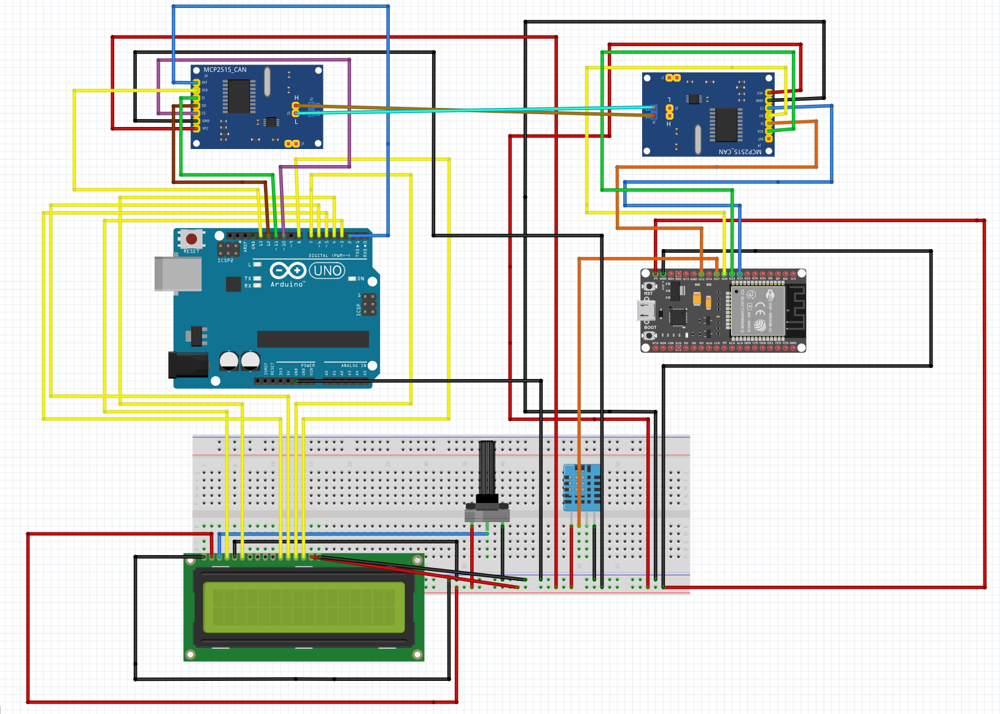

# Arduino UNO to ESP32 CAN comms
This repository includes the code and circuit diagram required to communicate DHT 11 temperature and humidity data via CAN from the ESP32 to Arduino using the MCP2515 shield.

The Arduino displays this information on a 16x2 LCD screen. This screen in particular does not have I^2C comms, hence the extra wiring.

Due to the Arduino not having enough power to provide power to all the LCD pins, MCP2515 module and potentiometer, the ESP32 was used to power the screen, potentiometer and the MCP2515 module of the Arduino, as well as its own MCP2515 module and the DHT11 sensor. This is because the ESP32 has superior power management to the Arduino, so can handle the extra components.

Ensure that the Arduino and ESP32 have the same grounding point, as seen in the diagram below.

When connecting the 2 microcontrollers to IDE, make sure the ESP32 is using COM4 and the Arduino is using COM3. This can be checked under Tools > Ports. It may be necessary to download drivers for the ESP32.

